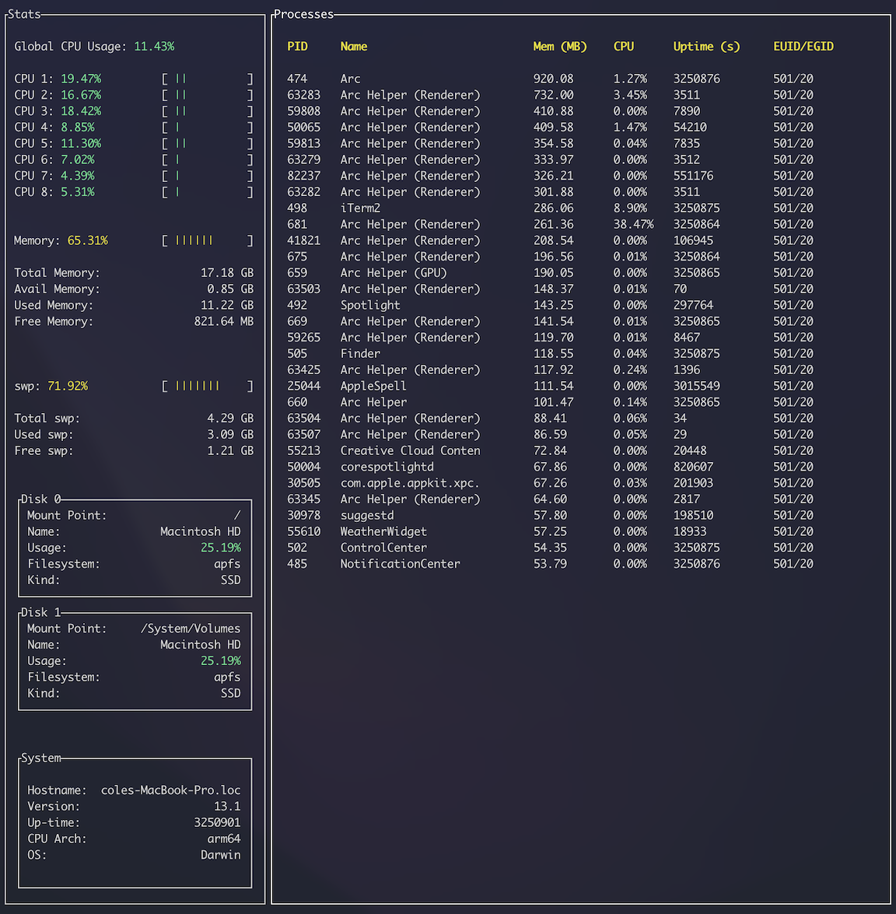

# Rust Resource Manager

A terminal-based resource manager, featuring a nice TUI for monitoring system resources and processes. 

## Features
- Left column visualizes important system statistics:
    - Global memory usage
    - Swap usage
    - CPU Usage (global and per-core)
    - Disk usage
    - OS metadata and specifics
- The other column displays all processes that exceed a certain threshold of memory consumption (eg >50 MB).
- Updates around every second, time may vary slightly due to the computation time when refreshing the system stats

## Dependencies
- Crossterm: Terminal interaction and control
- TUI: Rendering the user interface
- Sysinfo: providing all of the system and process information

## Notes
This program is designed to not take up the entire screen. You can maximize it if you want, but it does look a little wonky, I designed this to take up at most half of my screen if I want to see the processes, but you can reduce the size significantly if you do not wish to see the processes. 

I do plan on learning how to increase the accessibility by not rendering certain aspects if the size changes. 

The TUI library is actually really cool, and I am very happy with how this turned out. I am still learning rust and all three of the libraries I used are new to me.

Yes I know htop exists.